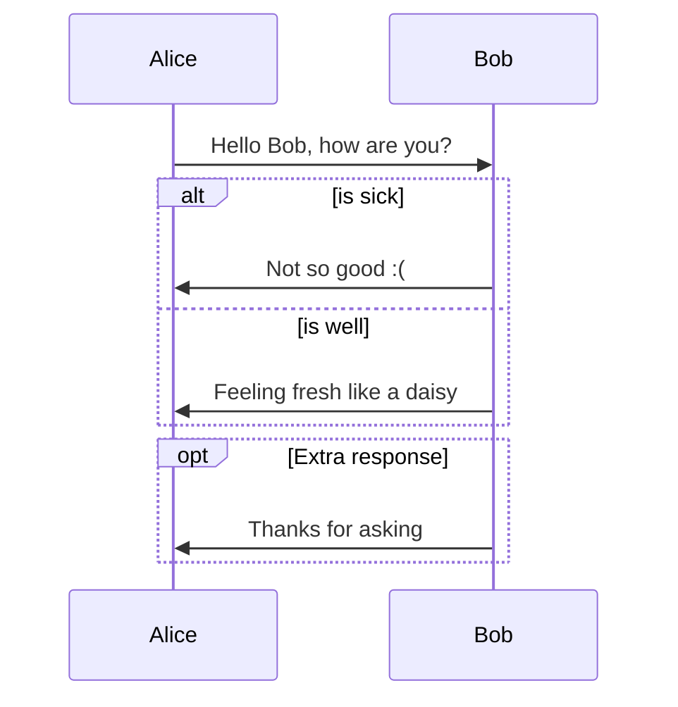




Testing GithubPages to publish my blog.

```markdown
---
layout: page
title: About
permalink: /about/
---

# Daniel Enrique Caro Peñaloza

`Senior Software Engineer`
`Devops Engineer`
`Chile`
```




--- 